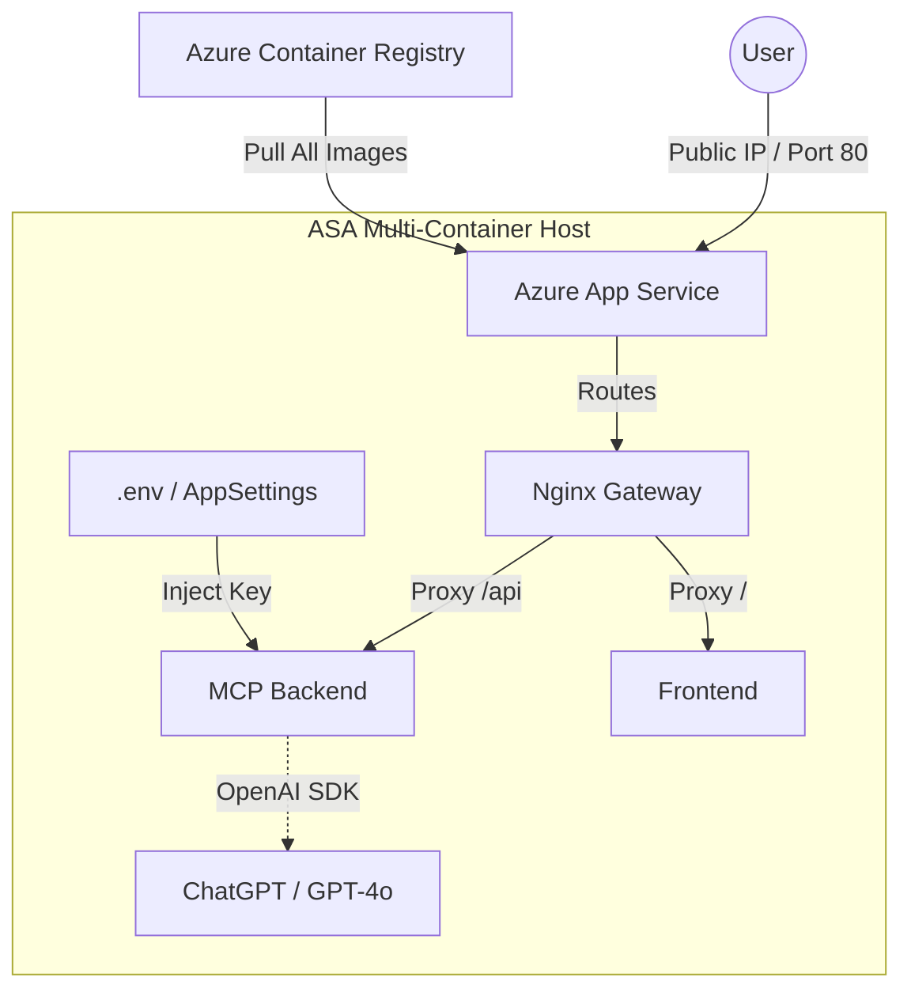

# 🚀 ASA (Azure App Service) Deployment Guide

This guide replaces the general Azure deployment and focuses on **Azure App Service (ASA)** using a multi-container Docker Compose approach.

## Architecture



The deployment is managed as a **Single Multi-Container App Service**, which is cost-effective and easy to manage for small-to-medium solutions.

**Names used:**
- **Resource Group:** `docxai-rg`
- **ACR Name:** `docxaicr`
- **App Service:** `docxai-app`
- **Automation:** `deploy-azure.sh` (One-click deployment script)

---

## 1. Automated Deployment (Fastest)
If you have the Azure CLI installed and are logged in, simply run:

```bash
chmod +x deploy-azure.sh
./deploy-azure.sh
```

---

## 2. Infrastructure Setup
**Goal:** Create Resource Group & Registry.

### 🔹 Option A: Azure CLI
```bash
# 1. Resource Group
az group create --name docxai-rg --location westeurope

# 2. Container Registry (ACR)
az acr create --resource-group docxai-rg --name docxaicr --sku Basic --admin-enabled true

# Login
az acr login --name docxaicr
```

---

### 🔹 ACR Build & Push (Recommended)
You must build and push all 3 images (including Nginx).

```bash
export ACR_NAME=docxaicr

# 1. MCP (API Backend)
docker build -f Dockerfile.mcp -t $ACR_NAME.azurecr.io/docxai-mcp:latest .
docker push $ACR_NAME.azurecr.io/docxai-mcp:latest

# 2. Frontend
docker build -f Dockerfile.frontend -t $ACR_NAME.azurecr.io/docxai-frontend:latest .
docker push $ACR_NAME.azurecr.io/docxai-frontend:latest

# 3. Nginx (Gateway)
docker build -f Dockerfile.nginx -t $ACR_NAME.azurecr.io/docxai-nginx:latest .
docker push $ACR_NAME.azurecr.io/docxai-nginx:latest
```

---

## 4. Deploy (Multi-Container App Service)
**Goal:** Create **ONE** App Service that runs `docker-compose-azure.yml`.

### 🔹 Option A: Azure CLI

1. **Create App Service Plan**
```bash
az appservice plan create --name docxai-plan --resource-group docxai-rg --sku B1 --is-linux
```

2. **Create the Web App**
```bash
az webapp create \
  --resource-group docxai-rg \
  --plan docxai-plan \
  --name docxai-app \
  --multicontainer-config-type compose \
  --multicontainer-config-file docker-compose-azure.yml
```

3. **Configure Settings (Link to ACR)**
```bash
# 0. Ensure Admin User is enabled (Critical)
az acr update -n docxaicr --admin-enabled true

export ACR_PASS=$(az acr credential show --name docxaicr --query "passwords[0].value" -o tsv)

# Set Registry Auth & Environment Variables
az webapp config appsettings set \
  --resource-group docxai-rg \
  --name docxai-app \
  --settings \
  DOCKER_REGISTRY_SERVER_URL="https://docxaicr.azurecr.io" \
  DOCKER_REGISTRY_SERVER_USERNAME="docxaicr" \
  DOCKER_REGISTRY_SERVER_PASSWORD=$ACR_PASS \
  DOCKER_REGISTRY="docxaicr.azurecr.io" \
  OPENAI_API_KEY="your-openai-key-here" \
  WEBSITES_PORT=80
```
*Note: `WEBSITES_PORT=80` tells Azure to expose the Nginx container.*

### 🔹 Option B: Azure Portal (GUI)
1.  **Create Web App**:
    *   Name: `docxai-app`.
    *   Publish: **Container**.
    *   OS: **Linux**.
    *   Plan: `docxai-plan`.
2.  **Container Tab**:
    *   Image Source: **Docker Compose (Preview)**.
    *   Registry Source: **Azure Container Registry**.
    *   Select your Registry (`docxaicr`).
    *   Config File: Upload `docker-compose-azure.yml`.
3.  **Settings**:
    *   Go to Configuration -> Application Settings.
    *   Add `WEBSITES_PORT` = `80`.
    *   Add `OPENAI_API_KEY` = `your-key`.
    *   Add `DOCKER_REGISTRY` = `docxaicr.azurecr.io` (Important variable used in the yaml file).

---

---

## 6. Cleanup
**Goal:** Delete all resources to avoid ongoing costs.

```bash
# Delete the entire resource group and all resources inside it
az group delete --name docxai-rg --yes --no-wait
```
*Note: `--no-wait` allows the command to return immediately while the deletion continues in the background.*
